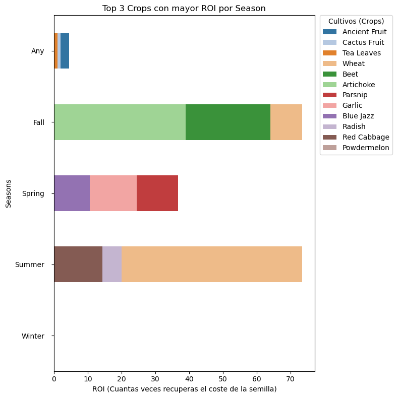

# 🌾 Análisis de Rentabilidad y ROI de Cultivos en Stardew Valley

[Python]
[Pandas]
[Seaborn]

Análisis de datos detallado para determinar la rentabilidad real y el Retorno de Inversión (ROI) de todos los cultivos del juego **Stardew Valley**, proyectando su rendimiento financiero a lo largo de una estación estándar de 28 días.

---

## 📌 Resumen del Proyecto

En *Stardew Valley*, la agricultura es el motor económico principal. Sin embargo, evaluar el éxito de un cultivo únicamente por su precio de venta individual puede llevar a decisiones financieras ineficientes. 

Este proyecto unifica los datos de cultivos de todas las estaciones, limpia el ruido del mercado y modela un ciclo completo de producción de **28 días** para comparar de forma justa:
1. **Cultivos de una sola cosecha** (sin regrowth).
2. **Cultivos renovables** (con regrowth) que producen múltiples veces tras una única inversión en semillas.

---

## 📊 Revelaciones Clave (Insights)

* **La Paradoja del Margen vs. ROI:** Los cultivos de alto margen neto unitario (como la *Sweet Gem Berry* en Otoño con \$2000 de ganancia) requieren un capital inicial masivo. En cambio, cultivos de bajo coste pero con múltiples cosechas como los **Blueberries** (Verano) o **Cranberries** (Otoño) ofrecen un **ROI exponencial**, ideal para jugadores en su primer año.
* **Estacionalidad Financiera:** El Verano y el Otoño representan los picos de liquidez y retorno de inversión del juego, mientras que la Primavera actúa como fase de acumulación y el Invierno como estación de subsistencia (ganancia agrícola neta de \$0).
* **El Factor "Regrowth":** Modelar el ciclo completo demuestra que ignorar la capacidad de rebrote sesga las decisiones. Los cultivos renovables diluyen el coste de la semilla a cero tras la primera cosecha, convirtiéndose en máquinas de flujo de caja continuo.

---

## 📈 Visualización Destacada

> *Inserta aquí el gráfico de barras horizontales de ROI que generamos en el notebook. Para subirlo, añade la imagen a tu repositorio de GitHub y apunta a ella abajo:*



---

## 🛠️ Tecnologías y Librerías Utilizadas

* **Python**
* **Pandas:** Carga, limpieza, unificación de múltiples archivos CSV, ingeniería de variables (cálculo de cosechas en 28 días) y manipulación de DataFrames.
* **Matplotlib & Seaborn:** Creación de visualizaciones estéticas, formateo de ejes numéricos y personalización de layouts gráficos.

---

## 📁 Estructura del Repositorio

```text
├── data/                         # Archivos CSV originales (raw data)
│   ├── spring_crops_info.csv
│   ├── summer_crops_info.csv
│   ├── fall_crops_info.csv
│   ├── winter_crops_info.csv
│   └── special_crops_info.csv
├── images/                       # Gráficos exportados para el README
│   └── roi_plot.png
├── 02_kaggle_stardewvalley.ipynb # Notebook principal con todo el análisis y código
└── README.md                     # Descripción del proyecto
